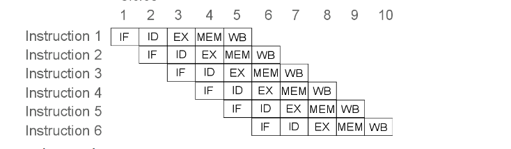

# PIPELINE
Implementación de etapas para ejecutar instrucciones, donde una instrucción empieza a ejecutarse antes de que hayan terminado las anteriores y, por tanto, que haya varias instrucciones procesando simultáneamente.

Etapas
- IF: Búsqueda de la instrucción en la memoria de programa.
- ID: Decodificación de la instrucción y lectura de registros.
- EX: Ejecución de la instrucción propiamente dicha.
- MEM: Lectura o escritura desde/hacia la memoria de datos.
- WB: Escritura de resultados en los registros.

# Modulo IF

#### Params

- `SIZE_PC`: 32 bits.

##### Entradas

- `i_clk`: Entrada de reloj.
- `i_reset`: Entrada de reinicio.
- `i_flag_start_pc`: Indica el inicio de la ejecucion del programa.
- `i_next_pc`: Siguiente address de programa.
- `i_enable`: Habilita la etapa IFID y activa los estados del PC.
- `i_flag_halt`: Señal de alto recibida desde la unidad de riesgo, terminando la ejecucion del programa.
- `i_flag_load_pc`: Indica que no se debe incrementar el contador de programa debido a un bloqueo.

#### Salidas

- `o_next_pc`: Siguiente address de programa.

#### Comportamiento

El modulo IF contiene una instancia del modulo PC para manejar el contador de programa y calcular la siguiente address de instruccion.

- `wire_pc_memory`: Almacena la address actual del contador de programa.
- `wire_next_pc`: Almacena la address dirección de programa calculada.

    # Modulo PC
    El valor del PC se actualiza basado en el estado actual y las señales de entrada.
    La salida `o_pc` refleja el valor actual del PC.
    La salida `o_next_pc` calcula el valor del siguiente PC,  agregando 4 bytes (o desplazando `i_nextPC`).
    ##### Params
    
    - `SIZE_ADDR_PC`: 32 bits.

    ##### Salidas
    
    - `o_pc`: Valor actual del contador de programa.
    - `o_next_pc`: Valor del siguiente contador de programa.
    
    ##### Estados
    
    - `IDDLE`: Estado inicial donde el PC se reinicia a 0. Transicion a `INCREMENT_PC` cuando se recibe la señal i_flag_start_pc.
    - `INCREMENT_PC`: Estado para incrementar el PC. Transicion a `FINISH_PC` cuando se recibe la señal i_flag_halt `NO_LOAD_PC` cuando se detecta un bloqueo. De lo contrario, incrementa el PC basado en `i_nextPC`.
    - `NO_LOAD_PC`: Estado para manejar bloqueos donde el PC no se incrementa. Transicion de regreso a `INCREMENT_PC`.
    - `FINISH_PC`: Estado terminal que indica la finalizacion del programa del modulo. Permanece en este estado en un bucle.
    
    
    
    

