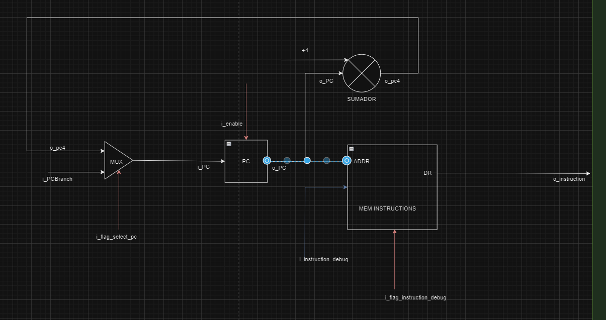

# PIPELINE
Implementación de etapas para ejecutar instrucciones, donde una instrucción empieza a ejecutarse antes de que hayan terminado las anteriores y, por tanto, que haya varias instrucciones procesando simultáneamente.

Etapas
- IF: Búsqueda de la instrucción en la memoria de programa.
- ID: Decodificación de la instrucción y lectura de registros.
- EX: Ejecución de la instrucción propiamente dicha.
- MEM: Lectura o escritura desde/hacia la memoria de datos.
- WB: Escritura de resultados en los registros.

# Modulo IF

#### Comportamiento

El modulo IF contiene una instancia del modulo PC para manejar el contador de programa y calcular la siguiente address de instruccion. También permite almacenar instrucciones dentro de la memoria. Ya que las intrucciones son cargadas por la Unidad de de Debug.

Mediante un Multiplexor se obtiene el PC correspondiente, podemos tener el caso que en la etapa siguiente el PC sea un PC+4 o corresponda a un _branch_ (PC consecuente de la ejecución de una instrucción de salto)

El valor del PC se actualiza basado en el estado actual y las señales de entrada como lo es _i_enable_ que habilita la etepa IFID y estamos en condiciones de obtener a la salida del modulo una direccion de memoria para obtener la siguiente instruccion. 

Tambien disponemos de un modulo que se encarga de incrementar el valor de PC en 4 y del modulo de la Memory Instruccion que se encarga de almancenar las instrucciones recibidas de la unidad de debug y la obtencion de la instruccion correpondiente a partir de un PC. 

    
    
    
    

